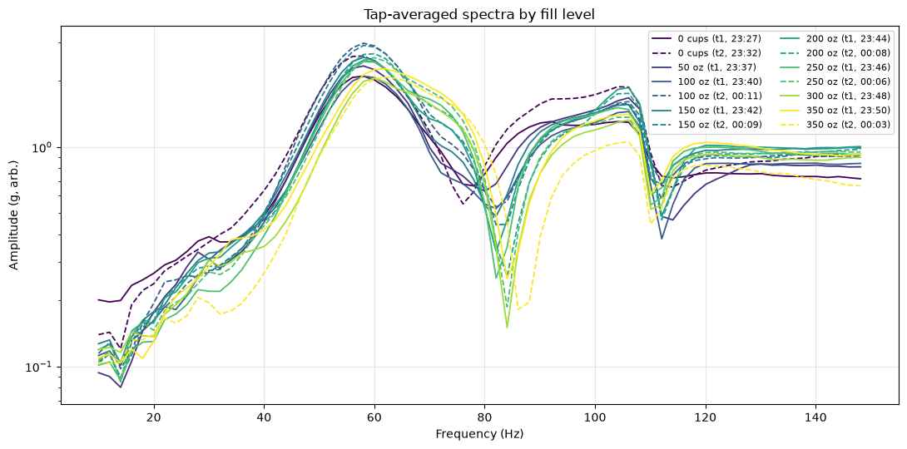
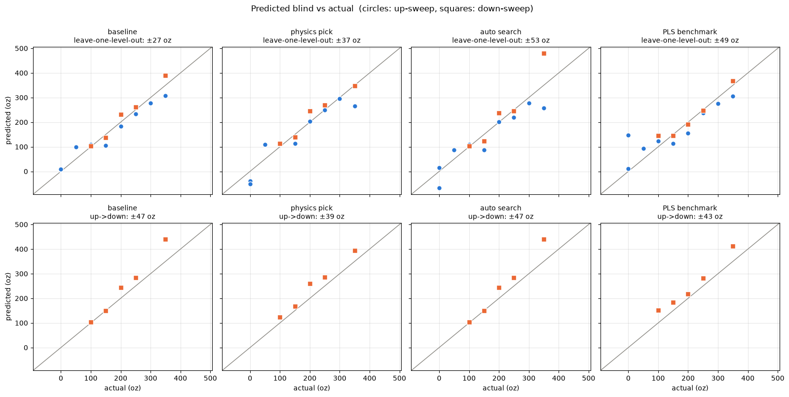
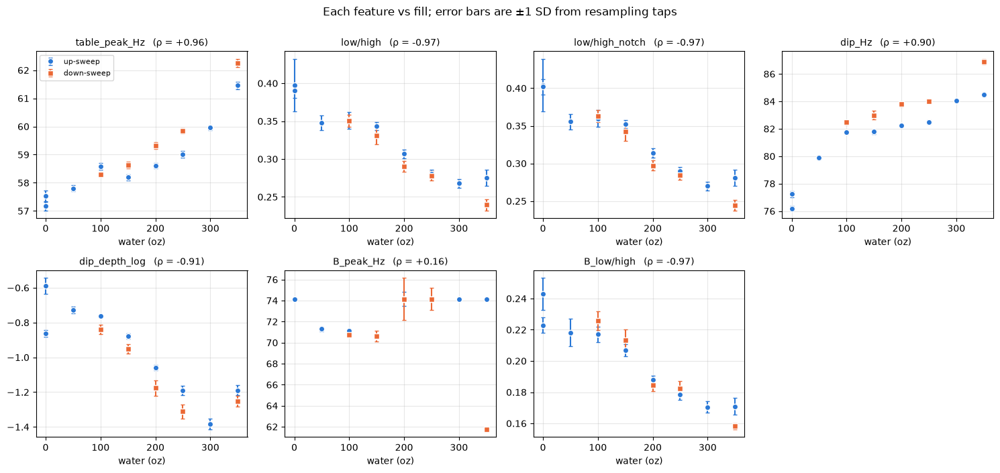

# Baja fuel gauge from vibration

Can you tell how much fuel is in a tank **without putting a sensor on the
tank**? This project tries to do it by tapping the frame, recording the
vibration with accelerometers beside the tank, and reading the fill level off
the spectrum.

It's for the [Baja SAE](https://www.bajasae.net/) off-road car at Olin
College. Competition rules forbid mounting a sensor on the
fuel tank, and the tank sits on four rubber O-rings. So the sensor has to live
on the frame and infer what's in the tank from how the structure next to it
vibrates.

**Status:** bench testing with a bucket of water standing in for the tank.
There's a working predictor, but it isn't yet reading the physics the project is
aiming for. Details below.



## The idea

A tank full of fuel sitting on rubber mounts is a mass on a spring:

$$f = \frac{1}{2\pi}\sqrt{\frac{k}{m_\text{tank} + m_\text{fuel}}}
\quad\Longrightarrow\quad
\frac{1}{f^2} = \frac{4\pi^2}{k}\left(m_\text{tank} + m_\text{fuel}\right)$$

So $1/f^2$ should be a straight line in fuel mass, and the line's
intercept-over-slope should come out as the empty tank's mass. That number isn't
fitted to anything, which makes it a real test of whether a frequency shift is
a mass effect. From the frame side, the tank's resonance shows up as a **dip**
(an anti-resonance), not a peak. At that frequency the tank pins the mount point
still.

## Bench setup

- **Container:** a bucket (838 g) on three rubber erasers on a table, filled in
  50 fl oz steps from empty to 350 oz (10.3 kg of water).
- **Sensors:** two ESP32 boards, each with an MPU6050 accelerometer at 1 kHz,
  ±8 g. Board A is taped to the table beside the bucket, board B farther away.
- **Excitation:** rubber-mallet taps on the table, about one a second, 30 s per
  run. The spectrum is averaged over all ~29 taps in a run.
- **Sweeps:** an up-sweep (filling), then a down-sweep (emptying) to separate
  the effect of load from the effect of time.

## What's been found so far

**The mass effect hasn't shown up yet.** Filling the bucket with 12× its own
mass of water should have dropped the resonance by about 72%. Instead the main
peak near 57 Hz *rose* about 4 Hz. It also crept upward at constant load and lagged
on the way back down. That's rubber: the erasers stiffen as the weight squashes
them. Nothing between 3 and 150 Hz moves down with fill on either board. The
likely reason is that the bucket's thin floor lets the water sit still while the
walls vibrate beneath it.

**A working predictor anyway.** Several features still track the fill level,
and [`02_predictor.ipynb`](02_predictor.ipynb) compares predictors built from
them. Every predictor is scored two ways, both of which predict fill levels the
fit never saw:

- **Leave-one-level-out:** each fill level is predicted by a fit trained on all
  the others.
- **Up→down:** fit on the filling runs, predict the emptying runs. In a car,
  fuel only goes down, and the rubber lags on the way down.

| Predictor | Leave-one-level-out | Up→down |
|---|---|---|
| Original: peak frequency + low/high energy ratio | ±27 oz | ±47 oz |
| **Chosen: ratio-dip frequency + low/high ratio** | ±37 oz | **±39 oz** |
| Automatic feature search (nested) | ±53 oz | ±47 oz |
| Whole-spectrum PLS (benchmark only) | ±49 oz | ±43 oz |
| *Always guessing the average* | *±113 oz* | |

The original predictor looks best on the first test, but most of its accuracy
comes from the rubber's loading history. The chosen one holds up on both.



Some other findings from the [feature survey](02_predictor.ipynb):

- **The low/high ratio is the steadiest signal.** It compares vibration energy
  at 5–50 Hz with 50–150 Hz. It's a genuine mass effect: the bucket's weight
  makes the table near it sluggish at low frequency.
- **The far board sees it too**, so the whole table is getting heavier, not
  just the spot next to the bucket.
- **Tap-to-tap noise is negligible.** The misses come from drift between runs,
  so more runs will help and more taps per run won't.



## Next experiments

1. **Accelerometer on the bucket itself** (allowed on the bench as ground
   truth), to settle whether the mass-on-spring resonance exists at all.
2. If the water turns out to be decoupled, **stiffen the container's floor** so
   it behaves more like a real tank.
3. **Mount check:** clamp or glue a board instead of taping it, to find the
   frequency above which taped data can't be trusted.
4. **On the car:** use two frame-side boards, with the engine's RPM sweep as a
   free broadband exciter.

## Repository

| | |
|---|---|
| [`baja_logger.ino`](baja_logger.ino) | ESP32 firmware (one sketch for both boards). 1 kHz deadline-loop sampling, ring-buffered, streams self-describing CSV over serial. |
| [`capture.py`](capture.py) | Laptop-side capture from one or two boards at once. |
| [`tapkit.py`](tapkit.py) | Shared analysis code: loading, tap detection, tap-averaged spectra, features, scoring. |
| [`01_setup_check.ipynb`](01_setup_check.ipynb) | Run first on each setup: data quality, spectra, the $1/f^2$ mass check, the two-board ratio. |
| [`02_predictor.ipynb`](02_predictor.ipynb) | Feature survey, predictor comparison, `predict_water`. |
| [`i2c_scan/`](i2c_scan/i2c_scan.ino) | I²C diagnostic that hunts for the accelerometers on plausible pin pairs. |
| [`data/`](data/) | One folder per physical setup, each with a `setup.md`. The CSV runs themselves (~17 MB) are not in the repo. |
| [`CONTEXT.md`](CONTEXT.md), [`docs/adr/`](docs/adr/) | Glossary of terms, and the reasoning behind how predictors are scored. |

## Running it

```sh
python3 -m venv venv && source venv/bin/activate
pip install -r requirements.txt

# record one run from two boards into a setup folder
python capture.py --port /dev/cu.usbmodem1101 --port2 /dev/cu.usbserial-0001 \
    --oz 50 --trial 1 --seconds 30 --out-dir data/my-setup
```

Then open the notebooks with `DATA_DIR` pointing at that folder. The run data
isn't in the repo, so the notebooks' saved outputs are the record of the
results above.

Hardware: ESP32-C3 and ESP32-WROOM dev boards, MPU6050 accelerometers over I²C.
Pin assignments and board-specific gotchas are in the firmware comments and
[`CLAUDE.md`](CLAUDE.md).
